# 🎬 Movie Site | سایت فیلم و سریال

## 📝 Description | توضیحات

A dynamic and feature-rich movie and series application that offers advanced search, genre filters, 3D slider, and user interaction.

Key Features:
- 🎞️ **3D & regular sliders** for showcasing movies and series  
- 🔍 **Simple and advanced search**  
- 🎭 **Genre-based filtering**  
- 💬 **Commenting on each movie**  
- ❤️ **Add movies to favorites**  
- 👤 **User registration and login**  
- 🧑‍💼 **Personalized user dashboard**

---

پروژه‌ای پویا برای نمایش فیلم و سریال با امکانات جستجوی پیشرفته، فیلتر ژانر، اسلایدر سه‌بعدی و تعامل با کاربر.

ویژگی‌های کلیدی:
- 🎞️ **اسلایدر سه‌بعدی و معمولی** برای نمایش فیلم‌ها و سریال‌ها  
- 🔍 **جستجوی ساده و پیشرفته**  
- 🎭 **فیلتر بر اساس ژانر**  
- 💬 **امکان ثبت نظر برای هر فیلم**  
- ❤️ **افزودن به لیست علاقه‌مندی‌ها**  
- 👤 **ثبت‌نام و ورود کاربران**  
- 🧑‍💼 **داشبورد اختصاصی برای هر کاربر**
  
## 📸 Screenshots | تصاویر پروژه

### 🖥️ Desktop Version | نسخه دسکتاپ

#### 🏠 Homepage

##### Slider3D  
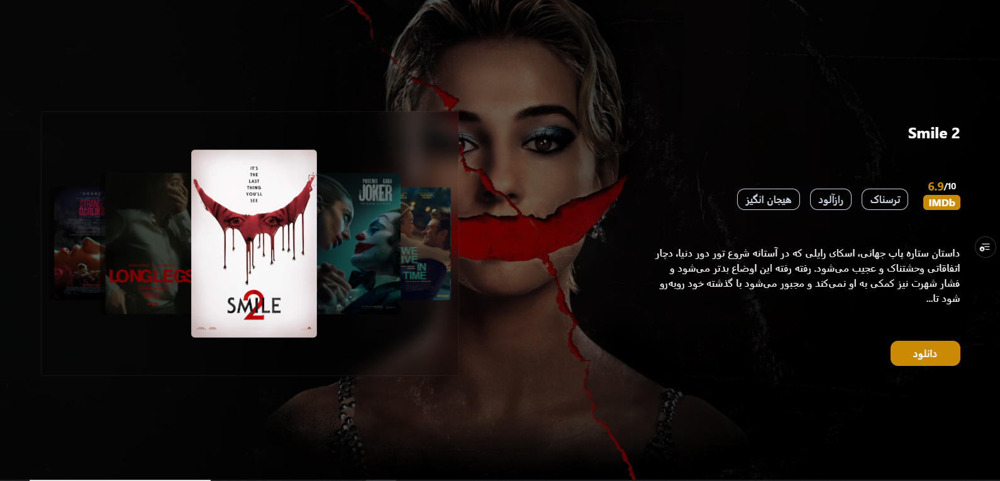

##### simple Slider  
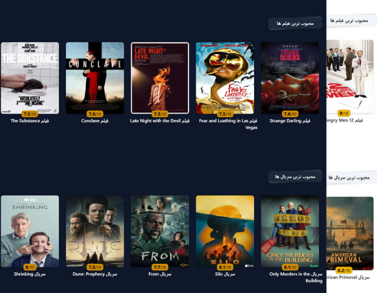

#### 🔍 Search Page
##### Simple Search  
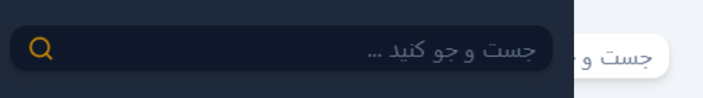

##### Advanced Search
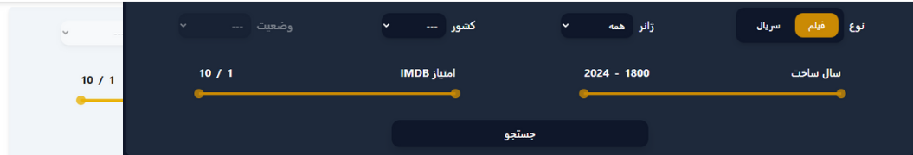

#### 🎬 Movie Page
##### Movie Detail  
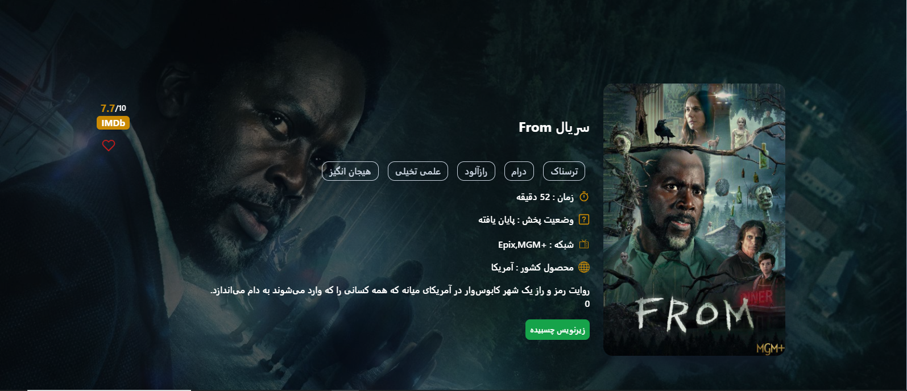

##### Movie Comments
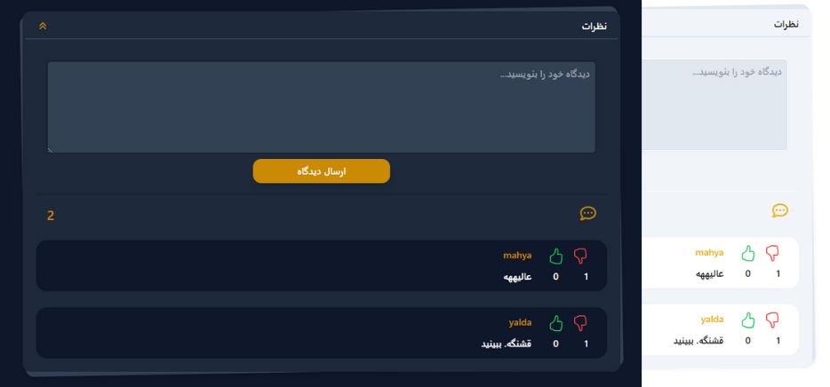


#### 👤 Auth
##### Login  
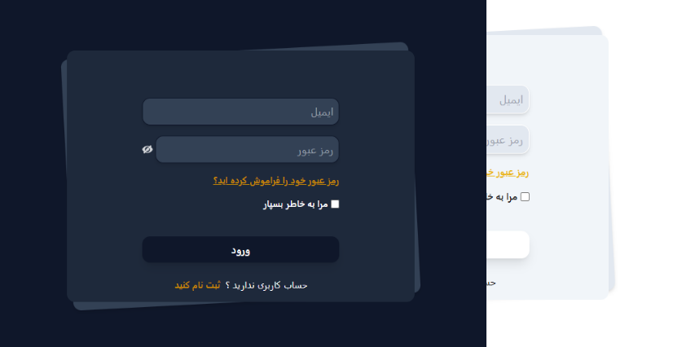

##### SignUp
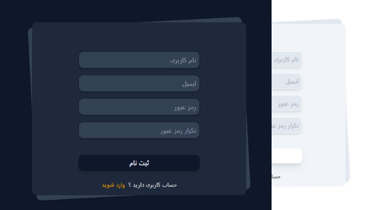

#### 🧑‍💼 User Panel
##### User Information  
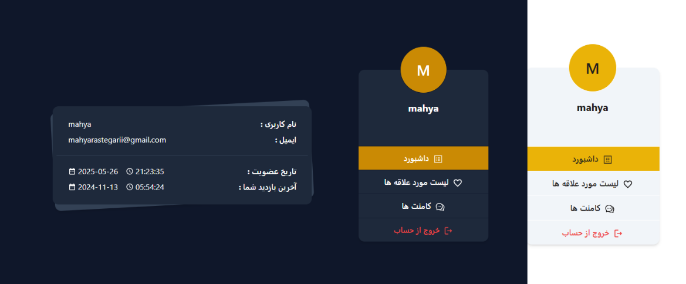

##### Favorites Page  
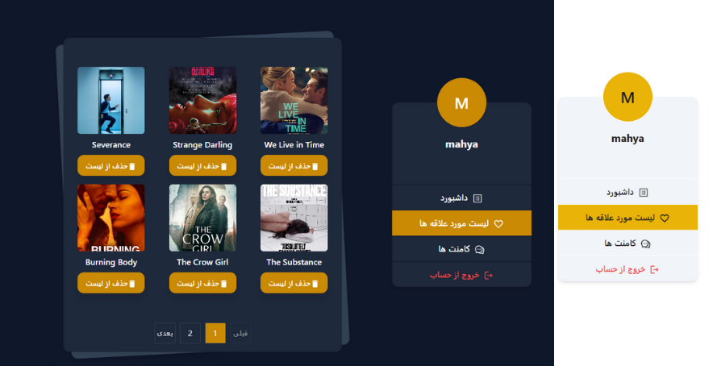

##### User Comments
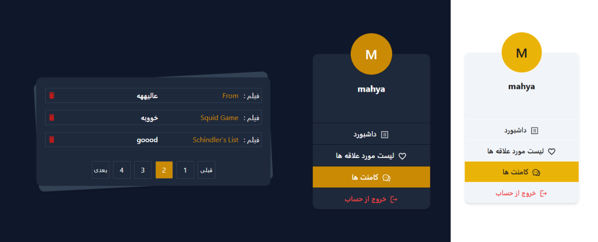


---

### 📱 Mobile Version | نسخه موبایل

##### 🏠 Homepage
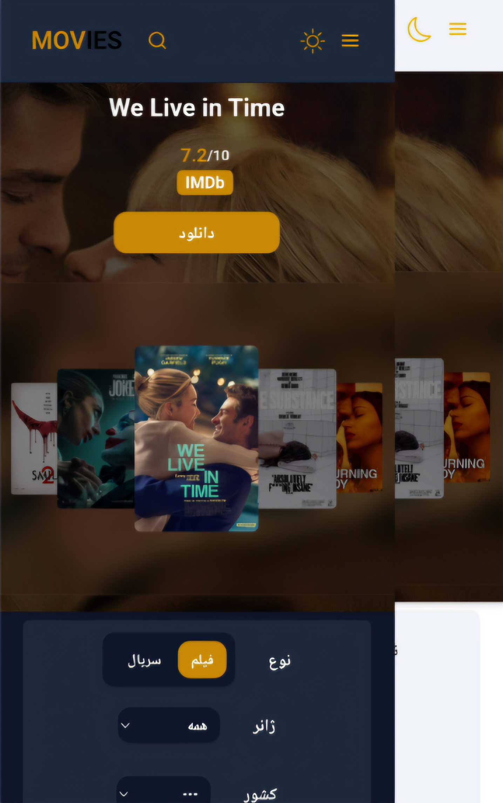


## 🔗 Live Demo | نسخه آنلاین  
👉 [movie-site-topaz.vercel.app](https://movie-site-topaz.vercel.app/)

## 🚀 Tech Stack | تکنولوژی‌ها

- React  
- Tailwind CSS  
- Redux Toolkit  
- Redux Persist  
- Supabase  
- Lodash  
- Swiper  
- React Router DOM  
- React Hook Form  
- React Toastify  

## ⚙️ Features | امکانات

- ✅ 3D movie slider  
- ✅ Simple and advanced search  
- ✅ Genre-based filter  
- ✅ Comment system  
- ✅ Favorites system  
- ✅ User registration & login  
- ✅ User dashboard  
- ✅ Responsive design  
- ✅ Client-side pagination   

---

- ✅ اسلایدر سه‌بعدی فیلم‌ها  
- ✅ جستجوی ساده و پیشرفته  
- ✅ فیلتر بر اساس ژانر  
- ✅ سیستم کامنت  
- ✅ لیست علاقه‌مندی‌ها  
- ✅ ثبت‌نام و ورود  
- ✅ پنل کاربری اختصاصی  
- ✅ طراحی ریسپانسیو  
- ✅ پیجینیشن سمت کلاینت  

## 📦 Installation | نصب و اجرا

```bash
git clone https://github.com/mahya-rastegarii/movie-app.git
cd movie-app
npm install
npm run dev
```

🎯 What I Learned | نکاتی که یاد گرفتم  

- Managing state with Redux Toolkit and Redux Persist
- Using Supabase as a full-featured backend solution
- Implementing advanced filtering and dynamic search functionality
- Utilizing Swiper.js to build professional and interactive sliders
- Building user dashboards and implementing authentication and authorization
- Client-side pagination for movie and series lists and comments lists
---
- مدیریت استیت با Redux Toolkit و Persist
- کار با Supabase به‌عنوان Backend کامل
- پیاده‌سازی فیلترهای پیشرفته و جستجوی داینامیک
- استفاده از Swiper برای ساخت اسلایدرهای حرفه‌ای
- ایجاد پنل کاربری و احراز هویت کاربران
- پیاده‌سازی پیجینیشن سمت کلاینت برای لیست فیلم‌ها و کامنت ها


## 🙋‍♀️ Contact Me | ارتباط با من  
📧 [Email](mahya.rastegari@gmail.com)  
💼 [LinkedIn](https://www.linkedin.com/in/mahya-rastegarii)


<p align="center">     </p>
